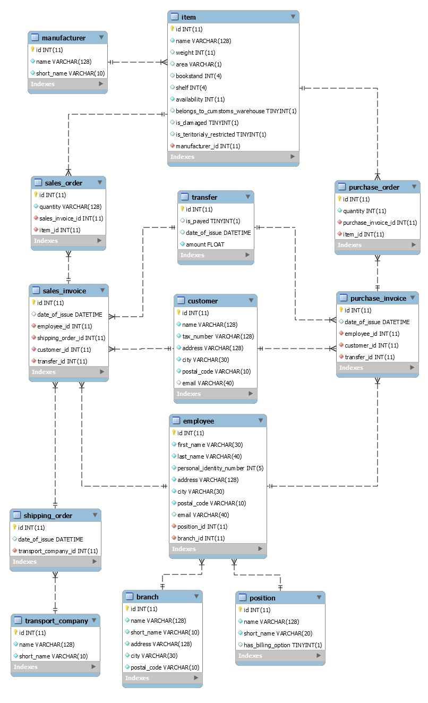

# Warehouse Management Program

>Application made to warehouse management.

## Table of contents
* [General info](#general-info)
* [Technologies](#technologies)
* [Screenshots](#screenshots)

## General info

I just started to work on this project. Inspiration to do this application was company where I work. On the server side it's application which displays proper API endpoints to front-side application which will be made in Angular.

## Technologies
* Java - version 1.8
* Spring - version 5.1.9.RELEASE
* Hibernate - version 5.4.8.RELEASE
* Maven - version 4.0.0
* MySQL driver

## Screenshots

Program is based on my own SQL schema:
